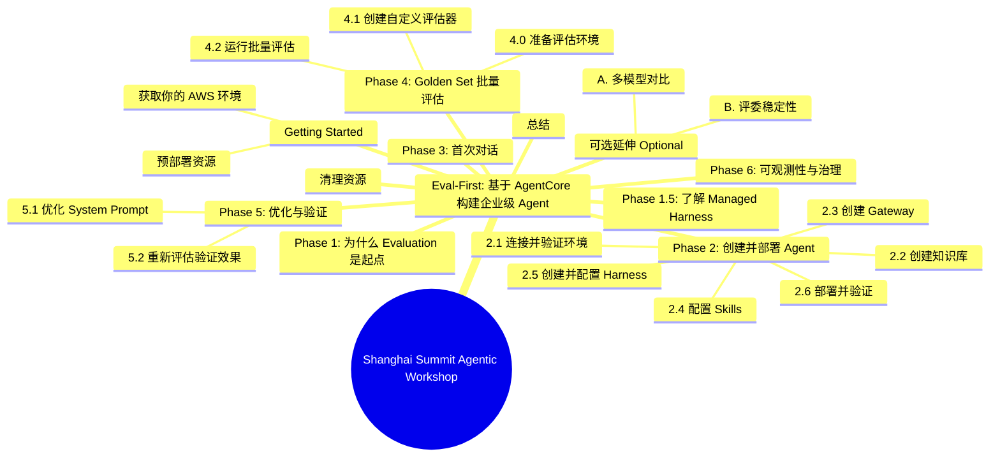

# Workshop Structure

```mermaid
mindmap
  root((Shanghai Summit Agentic Workshop))
    Eval-First: 基于 AgentCore 构建企业级 Agent
      Phase 1: 为什么 Evaluation 是起点
      Getting Started
        获取你的 AWS 环境
        预部署资源
      Phase 1.5: 了解 Managed Harness
      Phase 2: 创建并部署 Agent
        2.1 连接并验证环境
        2.2 创建知识库
        2.3 创建 Gateway
        2.4 配置 Skills
        2.5 创建并配置 Harness
        2.6 部署并验证
      Phase 3: 首次对话
      Phase 4: Golden Set 批量评估
        4.0 准备评估环境
        4.1 创建自定义评估器
        4.2 运行批量评估
      Phase 5: 优化与验证
        5.1 优化 System Prompt
        5.2 重新评估验证效果
      Phase 6: 可观测性与治理
      可选延伸 Optional
        A. 多模型对比
        B. 评委稳定性
      总结
      清理资源
```
